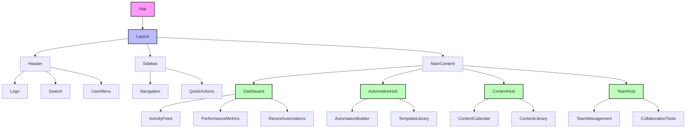
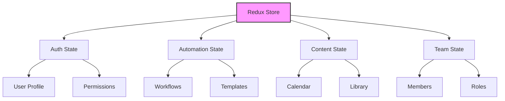

# Frontend Architecture & Implementation

## Component Hierarchy



## Implementation Structure

```typescript
// src/components/layout/
├── Header/
│   ├── Logo.tsx
│   ├── Search.tsx
│   └── UserMenu.tsx
├── Sidebar/
│   ├── Navigation.tsx
│   └── QuickActions.tsx
└── MainContent/
    ├── Dashboard/
    │   ├── ActivityFeed.tsx
    │   ├── PerformanceMetrics.tsx
    │   └── RecentAutomations.tsx
    ├── AutomationHub/
    │   ├── AutomationBuilder.tsx
    │   └── TemplateLibrary.tsx
    ├── ContentHub/
    │   ├── ContentCalendar.tsx
    │   └── ContentLibrary.tsx
    └── TeamHub/
        ├── TeamManagement.tsx
        └── CollaborationTools.tsx
```

## Component Implementation Examples

### 1. Layout Component
```typescript
// src/components/layout/Layout.tsx
import React from 'react';
import { Header } from './Header';
import { Sidebar } from './Sidebar';
import { MainContent } from './MainContent';

export const Layout: React.FC = ({ children }) => {
  return (
    <div className="flex h-screen bg-gray-100">
      <Sidebar />
      <div className="flex-1 flex flex-col overflow-hidden">
        <Header />
        <MainContent>
          {children}
        </MainContent>
      </div>
    </div>
  );
};
```

### 2. Dashboard Component
```typescript
// src/components/MainContent/Dashboard/Dashboard.tsx
import React from 'react';
import { ActivityFeed } from './ActivityFeed';
import { PerformanceMetrics } from './PerformanceMetrics';
import { RecentAutomations } from './RecentAutomations';

export const Dashboard: React.FC = () => {
  return (
    <div className="p-6 grid grid-cols-12 gap-6">
      <div className="col-span-8">
        <ActivityFeed />
        <RecentAutomations />
      </div>
      <div className="col-span-4">
        <PerformanceMetrics />
      </div>
    </div>
  );
};
```

### 3. Automation Builder Component
```typescript
// src/components/AutomationHub/AutomationBuilder.tsx
import React, { useState } from 'react';
import { TriggerSelector } from './TriggerSelector';
import { ActionConfigurator } from './ActionConfigurator';
import { ConditionBuilder } from './ConditionBuilder';

export const AutomationBuilder: React.FC = () => {
  const [currentStep, setCurrentStep] = useState(1);
  
  return (
    <div className="p-6">
      <div className="mb-6">
        <h2 className="text-2xl font-bold">Create New Automation</h2>
        <div className="flex mt-4">
          {['Trigger', 'Actions', 'Conditions', 'Test'].map((step, index) => (
            <div
              key={step}
              className={`flex-1 text-center p-2 ${
                currentStep > index ? 'bg-green-500' : 'bg-gray-200'
              }`}
            >
              {step}
            </div>
          ))}
        </div>
      </div>
      
      {currentStep === 1 && <TriggerSelector />}
      {currentStep === 2 && <ActionConfigurator />}
      {currentStep === 3 && <ConditionBuilder />}
    </div>
  );
};
```

## State Management



## Routing Structure

```typescript
// src/routes/index.tsx
import React from 'react';
import { Routes, Route } from 'react-router-dom';
import { Layout } from '../components/layout/Layout';
import { Dashboard } from '../components/Dashboard';
import { AutomationHub } from '../components/AutomationHub';
import { ContentHub } from '../components/ContentHub';
import { TeamHub } from '../components/TeamHub';

export const AppRoutes: React.FC = () => {
  return (
    <Routes>
      <Route path="/" element={<Layout />}>
        <Route index element={<Dashboard />} />
        <Route path="automations" element={<AutomationHub />} />
        <Route path="content" element={<ContentHub />} />
        <Route path="team" element={<TeamHub />} />
      </Route>
    </Routes>
  );
};
```

## Styling Approach

```typescript
// tailwind.config.js
module.exports = {
  theme: {
    extend: {
      colors: {
        primary: {
          50: '#f0f9ff',
          100: '#e0f2fe',
          // ... more colors
        },
      },
    },
  },
  plugins: [
    require('@tailwindcss/forms'),
    require('@tailwindcss/typography'),
  ],
};
```

## Component Library Integration

```typescript
// src/components/common/Button.tsx
import React from 'react';
import { cva, type VariantProps } from 'class-variance-authority';

const buttonVariants = cva(
  'inline-flex items-center justify-center rounded-md text-sm font-medium transition-colors',
  {
    variants: {
      variant: {
        primary: 'bg-primary-500 text-white hover:bg-primary-600',
        secondary: 'bg-gray-200 text-gray-900 hover:bg-gray-300',
        // ... more variants
      },
      size: {
        sm: 'h-9 px-3',
        md: 'h-10 px-4',
        lg: 'h-11 px-8',
      },
    },
    defaultVariants: {
      variant: 'primary',
      size: 'md',
    },
  }
);

export interface ButtonProps
  extends React.ButtonHTMLAttributes<HTMLButtonElement>,
    VariantProps<typeof buttonVariants> {}

export const Button = React.forwardRef<HTMLButtonElement, ButtonProps>(
  ({ className, variant, size, ...props }, ref) => {
    return (
      <button
        className={buttonVariants({ variant, size, className })}
        ref={ref}
        {...props}
      />
    );
  }
);
```

## Next Steps

1. **Setup Project**
   ```bash
   npx create-react-app my-app --template typescript
   cd my-app
   npm install @reduxjs/toolkit react-redux react-router-dom @tailwindcss/forms @tailwindcss/typography class-variance-authority
   ```

2. **Implement Components**
   - Start with Layout components
   - Build Dashboard
   - Add Automation Hub
   - Implement Content Hub
   - Create Team Hub

3. **Add State Management**
   - Setup Redux store
   - Create slices for each feature
   - Implement actions and reducers

4. **Style Implementation**
   - Configure Tailwind
   - Create component variants
   - Implement responsive design

Would you like me to:
1. Create a specific component implementation?
2. Set up the project structure?
3. Implement a particular feature?

Let me know what you'd like to focus on first! 