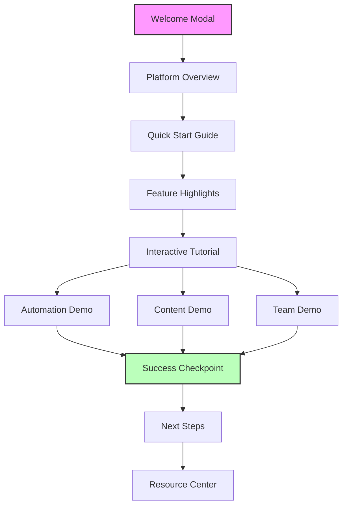
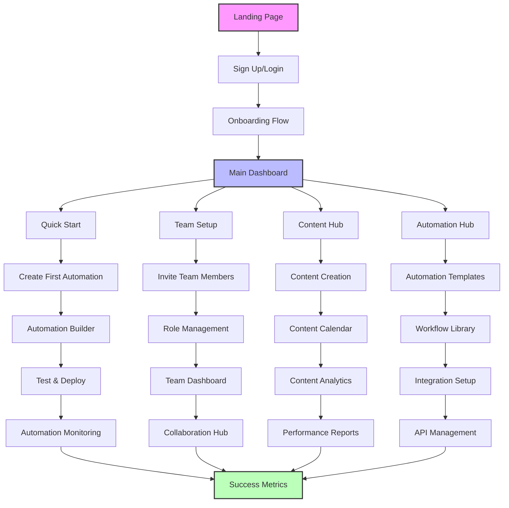

# Auto-Scheduler & Content Creator - User Journey

## Overview
This document outlines the user journey and interface flow for our automation and content management platform. The design focuses on efficiency, user-friendliness, and progressive feature discovery.

## First-Time User Demo & Walkthrough

### Interactive Onboarding Tour


### Demo Flow Details

1. **Welcome Experience**
   - Personalized welcome message
   - Quick platform overview video (30 seconds)
   - Option to skip tour (but can access later)

2. **Platform Overview (2-3 minutes)**
   - Main dashboard layout
   - Key navigation elements
   - Quick actions panel
   - Activity feed
   - Performance metrics

3. **Quick Start Guide**
   - Step 1: Create first automation
     - Trigger selection
     - Action configuration
     - Testing process
   - Step 2: Schedule first content
     - Content creation
     - Calendar view
     - Publishing options
   - Step 3: Invite team members
     - Role selection
     - Permission settings
     - Collaboration features

4. **Feature Highlights**
   - Automation Hub
     - Template library
     - Workflow builder
     - Integration options
   - Content Management
     - Calendar view
     - Content library
     - Analytics dashboard
   - Team Collaboration
     - Member management
     - Task assignment
     - Real-time updates

5. **Interactive Tutorial**
   - Hands-on automation creation
   - Content scheduling practice
   - Team invitation process
   - Each step includes:
     - Visual guidance
     - Tooltips
     - Success confirmation
     - Error prevention

6. **Success Checkpoint**
   - Completion celebration
   - Key achievements summary
   - Next steps suggestions
   - Resource recommendations

7. **Resource Center Access**
   - Video tutorials
   - Documentation
   - Community forum
   - Support contact

### Demo UI Elements

1. **Progress Indicator**
   ```
   [Step 1/5] Platform Overview
   ┌─────────────────────────────────────┐
   │ ■ ■ ■ □ □                           │
   │ 60% Complete                         │
   └─────────────────────────────────────┘
   ```

2. **Interactive Tooltips**
   ```
   ┌─────────────────────────────┐
   │ Create New Automation        │
   │ • Click the + button        │
   │ • Select trigger type       │
   │ • Configure actions         │
   │ [Try it now]               │
   └─────────────────────────────┘
   ```

3. **Success Messages**
   ```
   ┌─────────────────────────────┐
   │ 🎉 Great Job!               │
   │ You've created your first   │
   │ automation!                 │
   │ [Continue] [View Details]   │
   └─────────────────────────────┘
   ```

### Demo Best Practices

1. **Progressive Learning**
   - Start with basic concepts
   - Build complexity gradually
   - Allow practice at each step
   - Provide immediate feedback

2. **Engagement Techniques**
   - Interactive elements
   - Visual demonstrations
   - Success celebrations
   - Progress tracking

3. **Support Options**
   - Contextual help
   - Skip option
   - Replay capability
   - Support access

4. **Personalization**
   - Industry-specific examples
   - Role-based guidance
   - Customized suggestions
   - Relevant resources

### Demo Implementation

```typescript
// Example demo flow implementation
interface DemoStep {
  id: string;
  title: string;
  description: string;
  action: () => void;
  next: string;
  previous: string;
}

const demoFlow: DemoStep[] = [
  {
    id: 'welcome',
    title: 'Welcome to Auto-Scheduler',
    description: 'Let\'s get you started with the basics',
    action: showWelcomeModal,
    next: 'overview',
    previous: null
  },
  // ... more steps
];
```

### Demo Metrics

1. **Completion Rates**
   - Tour completion percentage
   - Step completion times
   - Drop-off points
   - Replay frequency

2. **Engagement Metrics**
   - Interaction rates
   - Feature adoption
   - Support requests
   - Feedback scores

3. **Success Indicators**
   - First automation creation
   - First content scheduled
   - First team member added
   - First integration setup

## User Journey Diagram



## Detailed User Flows

### 1. Initial Entry & Onboarding
- **Landing Page**
  - Clear value proposition
  - Social proof
  - Call-to-action buttons
  - Feature highlights

- **Authentication**
  - Email/password signup
  - Social login options
  - Password recovery
  - Email verification

- **Onboarding Flow**
  - Business information collection
  - Team size & structure
  - Industry selection
  - Initial automation needs assessment
  - Quick tour of key features

### 2. Main Dashboard
- **Quick Actions Panel**
  - Create new automation
  - Schedule content
  - Invite team members
  - View recent activity

- **Activity Feed**
  - Team updates
  - Automation status
  - Content approvals
  - System notifications

- **Performance Metrics**
  - Automation success rate
  - Content engagement
  - Team productivity
  - System health

### 3. Core Features

#### Automation Hub
- **Automation Builder**
  - Trigger selection
  - Action configuration
  - Condition setting
  - Testing environment
  - Deployment options

- **Template Library**
  - Industry-specific templates
  - Custom template creation
  - Template sharing
  - Version control

#### Content Management
- **Content Calendar**
  - Visual scheduling
  - Content types
  - Approval workflows
  - Publishing options

- **Content Library**
  - Asset management
  - Version history
  - Tagging system
  - Search & filter

#### Team Collaboration
- **Team Dashboard**
  - Member management
  - Role assignment
  - Permission settings
  - Activity monitoring

- **Collaboration Tools**
  - Comments & feedback
  - Task assignment
  - File sharing
  - Real-time updates

### 4. Advanced Features

#### Analytics & Reporting
- **Performance Dashboard**
  - Automation metrics
  - Content analytics
  - Team productivity
  - ROI calculations

- **Custom Reports**
  - Report builder
  - Data visualization
  - Export options
  - Scheduled reports

#### Integration Management
- **Integration Hub**
  - Available integrations
  - Connection setup
  - API management
  - Webhook configuration

#### Settings & Administration
- **Account Settings**
  - Profile management
  - Security settings
  - Notification preferences
  - Billing information

- **System Settings**
  - Team configuration
  - Automation rules
  - Content policies
  - Integration settings

## UI/UX Principles

### 1. Progressive Disclosure
- Start with essential features
- Reveal advanced options gradually
- Contextual help and tooltips
- Guided tours for complex features

### 2. Consistent Navigation
```
Header
├── Logo & Brand
├── Main Navigation
├── Quick Actions
└── User Menu

Sidebar
├── Primary Features
│   ├── Dashboard
│   ├── Automations
│   ├── Content
│   └── Team
└── Secondary Features
    ├── Analytics
    ├── Settings
    └── Help
```

### 3. Visual Hierarchy
- Primary actions: Large, prominent buttons
- Secondary actions: Standard buttons
- Tertiary actions: Links or menu items
- Status indicators: Clear and consistent

### 4. Feedback Systems
- Success/error messages
- Progress indicators
- Status updates
- Confirmation dialogs
- Toast notifications

## Implementation Phases

### Phase 1: Core Foundation
- Authentication system
- Main dashboard structure
- Basic profile management
- Essential navigation

### Phase 2: Essential Features
- Team management
- Basic automation creation
- Content management basics
- Simple analytics

### Phase 3: Advanced Features
- Advanced automation tools
- Comprehensive analytics
- Client management
- Integration marketplace

### Phase 4: Polish & Enhancement
- Advanced customization
- Performance optimization
- Mobile responsiveness
- Accessibility improvements

## Frontend Architecture

```
src/
├── components/
│   ├── common/          # Reusable UI components
│   ├── layout/          # Layout components
│   ├── features/        # Feature-specific components
│   └── forms/           # Form components
├── pages/               # Main page components
├── hooks/               # Custom React hooks
├── context/             # Context providers
├── services/            # API services
└── utils/              # Utility functions
```

## Key Performance Indicators (KPIs)

1. **User Engagement**
   - Time to first automation
   - Feature adoption rate
   - User retention
   - Session duration

2. **System Performance**
   - Page load time
   - Automation execution time
   - API response time
   - Error rate

3. **Business Metrics**
   - User acquisition cost
   - Customer lifetime value
   - Churn rate
   - Revenue growth 